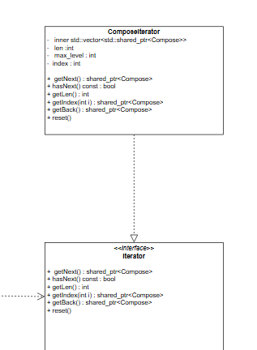
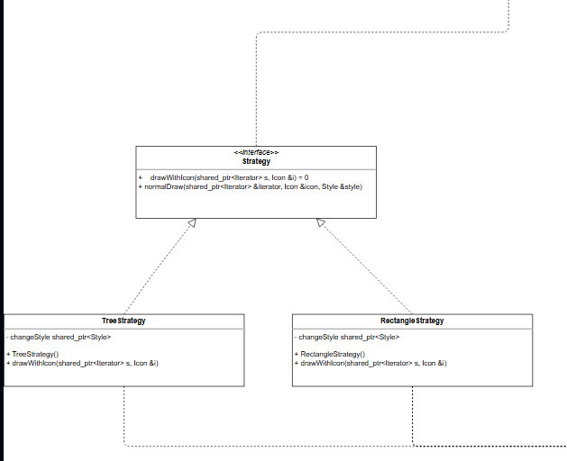
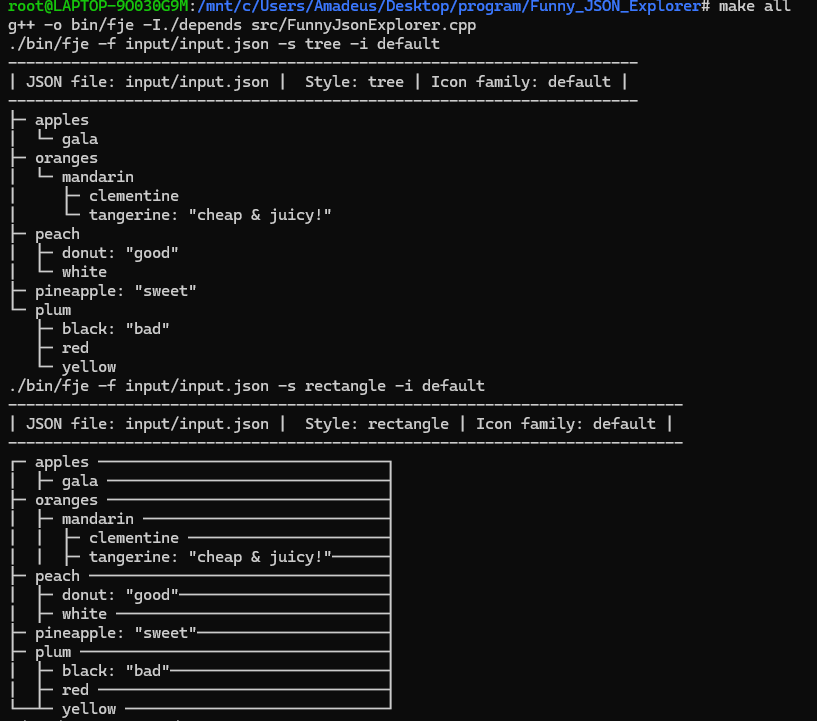
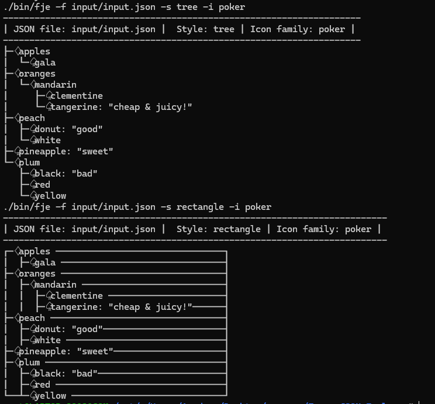

# Funny JSON Explorer

## 运行环境

WSL2.0（Ubuntu22.04）

## 迭代器+策略模式

在这种组合中，迭代器负责遍历集合中的元素，而策略模式提供了不同的迭代算法或行为，可以根据需要在运行时切换。

### UML图

> test.svg


### 迭代器模式

迭代器模式是一种行为设计模式，它允许你顺序访问一个集合对象中的元素，为了方便程序编写笔者加上了重置和访问尾部元素的函数



### 策略模式

策略模式（Strategy Pattern）是一种定义一系列算法，在运行时选择使用哪一个算法的设计模式。这种模式将算法封装起来，并使它们可以互换

笔者定义了策略接口`drawWithIcon`，只需要迭代器对象和图标对象作为参数传入客户定义的策略即可



## 测试截图

### 测试文件

```json
{
  "oranges": {
    "mandarin": {
    "clementine": null,
    "tangerine": "cheap & juicy!"
  }
},
  "apples": {
    "gala": null
  },
  "peach" :{
    "donut": "good",
    "white": null
  },
  "plum": {
    "red": null,
    "black": "bad",
    "yellow": null
  },
  "pineapple": "sweet"
}
```

### 结果截图

2种风格与2种图标混搭




