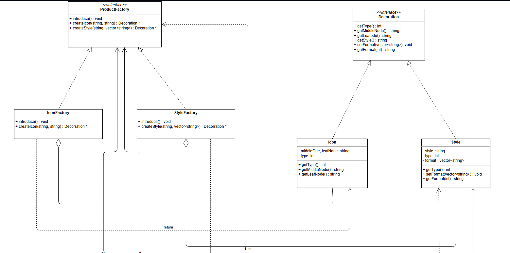
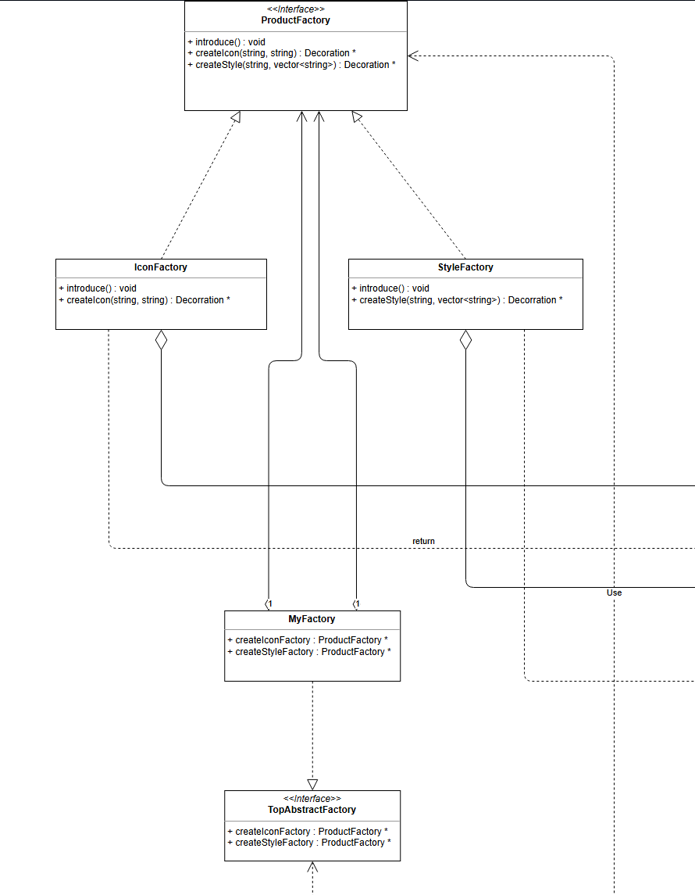
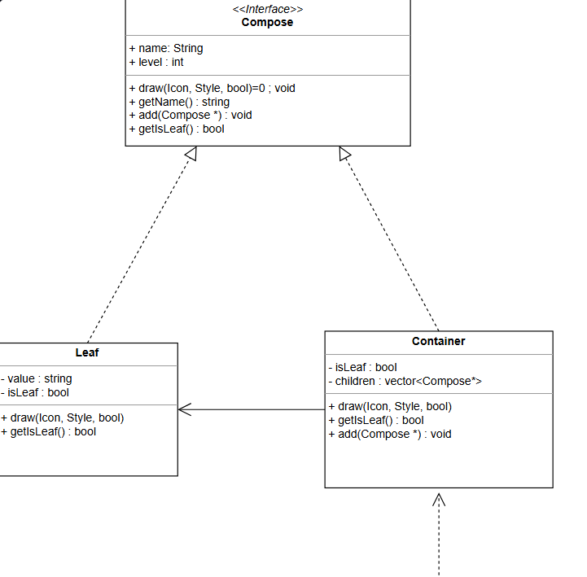
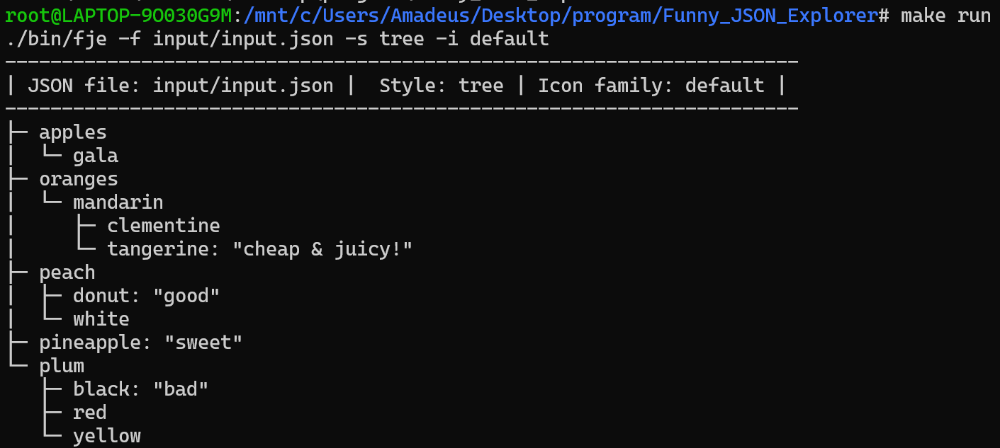
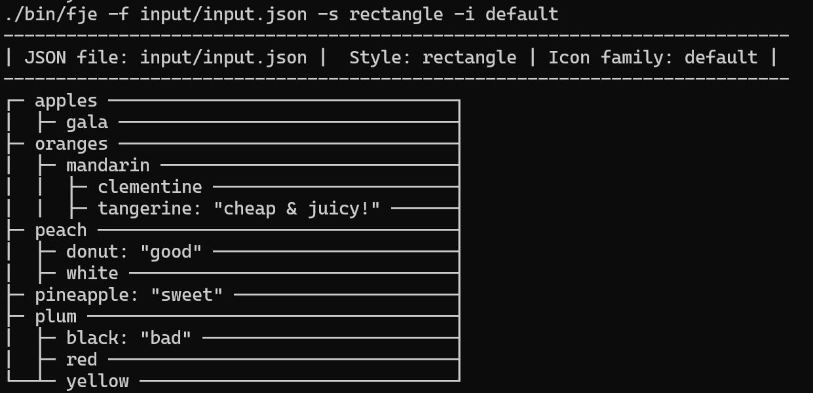
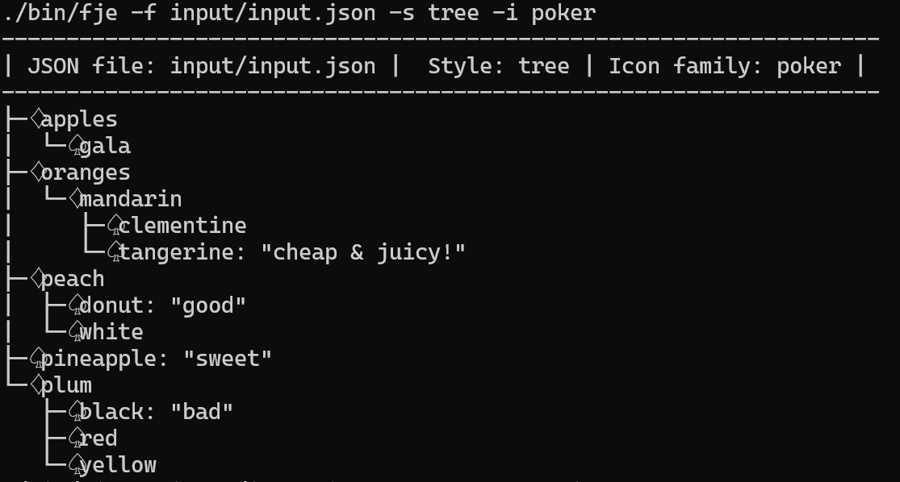
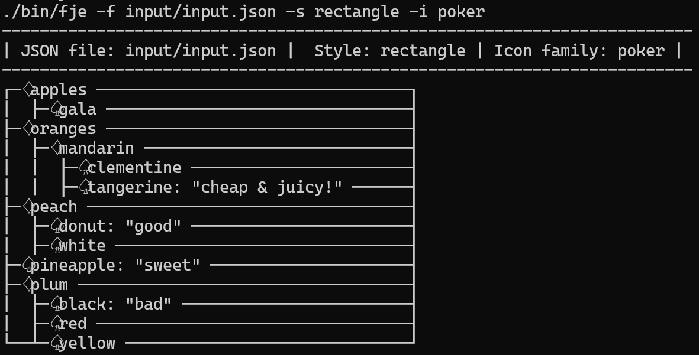

# Funny JSON Explorer

## 运行环境

WSL2.0（Ubuntu22.04）

## 类图

大图位于`readme.assets/test.svg`内


## 设计模式说明

### 工厂方法

其定义是一个创建产品对象的工厂接口，将产品对象的实际创建工作推迟到具体子工厂类当中

在笔者的UML图中，产品`Icon`，`Style`分别由具体子工厂`IconFactory`，`StyleFactory`生产，两子工厂向上提供创建产品的接口



### 抽象工厂

其定义为用来生产不同产品族的全部产品。

使用抽象工厂模式一般要满足以下条件：
  1) 系统中有多个产品族，每个具体工厂创建同一族但属于不同等级结构的产品。
  2) 系统一次只可能消费其中某一族产品，即同族的产品一起使用。

最顶层的抽象类`TopAbstractFactory`为抽象工厂，`MyFactory`实现其创建两种工厂的接口，即在此模式中`ProductFactory`是产品



### 建造者模式

指将一个复杂对象的构造与它的表示(给对象属性赋值)分离，使同样的构建过程可以创建不同的表示(给对象属性赋值)，这样的设计模式被称为建造者模式。它是将一个复杂的对象分解为多个简单的对象，然后一步一步构建而成。它将变与不变相分离，即产品的组成部分是不变的，但每一部分是可以灵活选择的。

在笔者的UML中，类`JsonExplorer`就是起到导演的作用，通过设定自身内部的具体工厂再调用它们的接口来达到生产不同产品的目的。


### 组合模式

有时又叫作部分-整体模式，它是一种将对象组合成树状的层次结构的模式，用来表示“部分-整体”的关系，使用户对单个对象和组合对象具有一致的访问性。

在笔者的UML中，`Compose`，`Leaf`，`Container`就是这样的关系。`Compose`定义了组合对象的所有接口， `Container`是一个整体，`Leaf`属于其中的部分。



## 运行

include存放头文件，src存放源码，bin存放编译后的文件，input存放要输入的json文件

编译:

```shell
make build
```

测试：

```shell
make run
```

编译且测试：

```shell
make all
```

运行单例：

```shell
./bin/fje -f <json file> -s <style> -i <icon family>
```

style支持两种：tree和rectangle

icon family支持两种：default和poker

## 可扩展性

要想自定义您自己的工厂，只需继承TopAbstractFactory并实现其接口，通过接口创建您自己的图标工厂和风格工厂即可

图标工厂接受两个字符串（中间节点与叶子节点）作为参数，创造`Icon`产品

风格工厂接受一个字符串（风格名称）与格式数组`vector<string> format`作为参数，创造`Style`产品

将这两个产品作为参数输入到`JsonExplorer.draw`函数即可完成绘制

## 测试截图

### 测试文件

```json
{
  "oranges": {
    "mandarin": {
    "clementine": null,
    "tangerine": "cheap & juicy!"
  }
},
  "apples": {
    "gala": null
  },
  "peach" :{
    "donut": "good",
    "white": null
  },
  "plum": {
    "red": null,
    "black": "bad",
    "yellow": null
  },
  "pineapple": "sweet"
}
```

### 结果截图

2种风格与2种图标混搭









